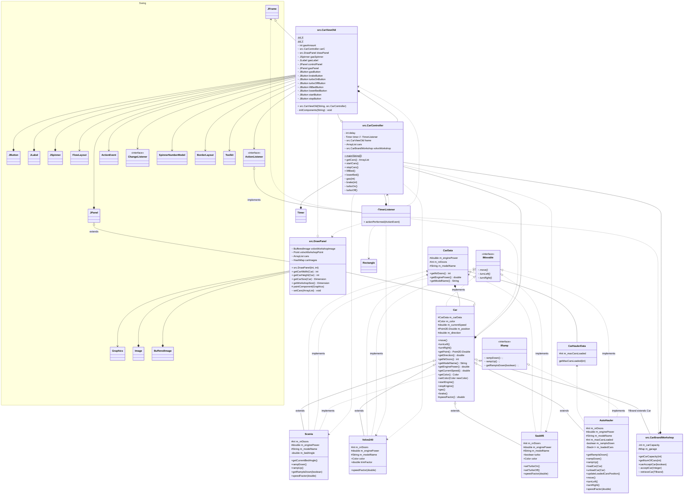

<!-- https://mermaid.js.org/syntax/classDiagram.html -->

# UML Digram - before refactoring

```
+   Public
-   Private
#   Protected
~   Package/Internal
```

```
<|--    Inheritance
*--     Composition (A owns B, B can't be independent)
o--	    Aggregation (A owns B, B can be independent
-->     Association
--      Link (Solid)
..>     Dependency
..|>    Realization
..      Link (Dashed)
```


