<!-- https://mermaid.js.org/syntax/classDiagram.html -->

# UML Digram - before refactoring

```
+   Public
-   Private
#   Protected
~   Package/Internal
```

```
<|--    Inheritance
*--     Composition (A owns B, B can't be independent)
o--	    Aggregation (A owns B, B can be independent
-->     Association
--      Link (Solid)
..>     Dependency
..|>    Realization
..      Link (Dashed)
```



```mermaid
---
config:
    displayMode: compact
    layout: elk
    elk:
        mergeEdges: true
        nodePlacementStrategy: SIMPLE
---

classDiagram



namespace Models {
    class Car
    class IRamp
    class IMovable

    class Volvo240
    class Saab95
    class Scania
    class AutoHauler

    class CarBrandWorkshop
}

    Car <|-- Scania: extends
    Car <|-- Volvo240: extends
    Car <|-- Saab95: extends
    Car <|-- AutoHauler: extends

    class IMovable {
        ~ move()*
        ~ turnLeft()*
        ~ turnRight()*
    }

    class IRamp {
        ~ rampDown();
        ~ rampUp();
        ~ getRampIsDown(boolean);
    }

    <<interface>> IMovable
    IMovable <|.. Car: implements
    IMovable <|.. Saab95: implements
    IMovable <|.. Scania: implements
    IMovable <|.. Volvo240: implements
    IMovable <|.. AutoHauler: implements
    <<interface>> IRamp
    IRamp <|.. Scania: implements
    IRamp <|.. AutoHauler: implements

    class Car {
        #Color m_color
        #double m_currentSpeed
        #Point2D.Double m_position
        #double m_direction
        +move()
        +turnLeft()
        +turnRight()
        +getPoint() Point2D.Double
        +getDirection() double
        +getNrDoors() int
        +getModelName() String
        +getEnginePower() double
        +getCurrentSpeed() double
        +getColor() Color
        +setColor(Color newColor)
        +startEngine()
        +stopEngine()
        +gas()
        +brake()
        #speedFactor()* double
    }

    class Scania {
        #int m_nrDoors
        #double m_enginePower
        #String m_modelName
        -double m_bedAngle
        +getCurrentBedAngle()
        +rampDown()
        +rampUp()
        +getRampIsDown(boolean)
        +speedFactor(double)

        +getNrDoors() int
        +getEnginePower() double
        +getModelName() String
    }
    class Volvo240 {
        #int m_nrDoors
        #double m_enginePower
        #String m_modelName
        +Color color
        +double trimFactor
        +speedFactor(double)
        +getNrDoors() int
        +getEnginePower() double
        +getModelName() String
    }
    class Saab95 {
        #int m_nrDoors
        #double m_enginePower
        #String m_modelName
        +boolean turbo
        +Color color
        +setTurboOn()
        +setTurboOff()
        +speedFactor(double)
        +getNrDoors() int
        +getEnginePower() double
        +getModelName() String
    }
    class AutoHauler {
        #int m_nrDoors
        #double m_enginePower
        #String m_modelName
        #int m_maxCarsLoaded
        -boolean m_rampIsDown
        -Stack<> m_loadedCars
        +getRampIsDown()
        +rampDown()
        +rampUp()
        +loadCar(Car)
        +unloadCar(Car)
        +updateLoadedCarsPosition()
        +move()
        +turnLeft()
        +turnRight()
        +speedFactor(double)
        +getNrDoors() int
        +getEnginePower() double
        +getModelName() String
    }

    Car <|-- CarBrandWorkshop: TBrand extends Car

    class CarBrandWorkshop {
        -int m_carCapacity
        #Map<Integer, TBrand> m_garage
        +getCarCapacity(int)
        +getNumOfCars(int)
        +canAcceptCar(boolean)
        ~ acceptCar(Integer)
        ~ retrieveCar(TBrand)
    }

%% Swing library
namespace Swing {
    class JPanel
    class JFrame
    class JButton
    class JLabel
    class JSpinner

    class Graphics
    class FlowLayout
    class Image
    class BufferedImage
    class ActionListener
    class ActionEvent
    class ChangeListener

    class SpinnerNumberModel
    class BorderLayout
    class Toolkit
}

    class JPanel { }
    class JFrame { }
    class JButton { }
    class Graphics { }
    class FlowLayout { }
    class Image { }
    class BufferedImage { }
    class ActionListener { }
    <<interface>> ActionListener
    class ActionEvent { }

    class ChangeListener { }
    <<interface>> ChangeListener

    class SpinnerNumberModel { }
    class BorderLayout { }
    class Timer { }
    class Toolkit { }

namespace GUI {
    class DrawPanel
    class CarView
    class CarController
}

    class DrawPanel {
        ~ BufferedImage volvoWorkshopImage
        ~ Point volvoWorkshopPoint
        ~ ArrayList<Car> cars
        ~ HashMap<String, Image> carImages
        
        + DrawPanel(int, int)
        + getCarWidth(Car) int
        + getCarHeight(Car) int
        + getCarSize(Car) Dimension
        + getWorkshopSize() Dimension
        # paintComponent(Graphics)
        ~ setCars(ArrayList<Car>) void
    }
    JPanel <|-- DrawPanel: extends
    DrawPanel --* Image
    DrawPanel --* BufferedImage
    DrawPanel --o Car
    DrawPanel --> Graphics

    class CarView {
        -int X$
        -int Y$
        ~ int gasAmount
        ~ CarController carC
        ~ DrawPanel drawPanel
        ~ JSpinner gasSpinner
        ~ JLabel gasLabel
        ~ JPanel controlPanel
        ~ JPanel gasPanel
        ~ JButton gasButton
        ~ JButton brakeButton
        ~ JButton turboOnButton
        ~ JButton turboOffButton
        ~ JButton liftBedButton
        ~ JButton lowerBedButton
        ~ JButton startButton
        ~ JButton stopButton
        
        + CarView(String, CarController)
        - initComponents(String) void

        ~ getAreaSize(Car) Dimensions
        ~ getCarSize(Car) Dimensions
    }
    JFrame <|-- CarView
    CarView --o CarController
    CarView ..o DrawPanel
    CarView --* JSpinner
    CarView --* JLabel
    CarView --* JPanel
    CarView --* JButton
    CarView --> FlowLayout
    CarView --> BorderLayout
    CarView --> Toolkit
    CarView --> SpinnerNumberModel
    CarView --> ActionEvent
    CarView --> ActionListener
    CarView --> ChangeListener

    class CarController {
        - int delay
        - Timer timer // -TimerListener
        ~ CarView frame
        ~ ArrayList<Car> cars
        ~ CarBrandWorkshop<Volvo240> volvoWorkshop
        
        + main(String[]) $
        + getCars() ArrayList<Car>
        + startCars()
        + stopCars()
        + liftBed()
        + lowerBed()
        ~ gas(int)
        ~ brake(int)
        ~ turboOn()
        ~ turboOff()

        - actionPerformed(ActionEvent)
    }
    CarController --* Timer
    CarController --* -TimerListener
    CarController --* CarView
    CarController --* Car
    CarController --* CarBrandWorkshop
    CarController ..> Volvo240
    CarController ..> Saab95
    CarController ..> Scania
    CarController ..> Rectangle
```

# Ändringar sedan V1:

- Tog bort CarData. La till getNrDoors, getEnginePower, getModelName istället
- Tog bort relation mellan CarController/TimerListener och DrawPanel - ersätts
  med frame.getPanelSize() och frame.getCarSize()

### TODO

- Vilka relationer är nödvändiga? Dimension? Rectangle?
- I och med att TimerListener är privat och inte läcks bör det vara ok att säga
  att den är samma som CarController i UML-diagrammet? => flyttade alla
  relationer från TimerListener till CarController
