<!-- https://mermaid.js.org/syntax/classDiagram.html -->

# UML Digram - before refactoring

```
+   Public
-   Private
#   Protected
~   Package/Internal
```

```
<|--    Inheritance
*--     Composition (A owns B, B can't be independent)
o--	    Aggregation (A owns B, B can be independent)
-->     Association (Child and Parent)
--      Link (Solid)
..>     Dependency (use)
..|>    Realization
..      Link (Dashed)

```



```mermaid
---
config:
    look: classic
    displayMode: compact
    layout: elk
    elk:
        mergeEdges: true
        nodePlacementStrategy: SIMPLE
---

classDiagram



  namespace abc {
      class ICarConstructor
      class ICarSystemFactory
      class IDriveSubscriber
      class IGameTickHandler
      class IGameTickSubscriber
      class IRaiseLowerBedSubscriber
      class ITurboSubscriber
      class IView
      class IViewActionsHandler
    
    class Application
    class CarSystem
    class CarSystemFactory
    class CarView
    class Model
    class Publisher
    class RenderData
    class ScaniaSystem
    class Volvo240System
    class Saab95System
  }

  namespace loadable {
    class IMovable
    class IRamp

    
    class Car
    class Volvo240
    class Saab95
    class Scania
  }
  
  namespace src {
      class CarBrandWorkshop
  }
  class external_resources{ }
  
  
  
  
  class ICarConstructor {
    ~ makeCar(int, int)(): T
    ~ makeWorkshop(int): CarBrandWorkshop<T>
  }
  <<interface>> ICarConstructor

  class ICarSystemFactory {
    ~ createSystem(String): CarSystem<?>
  }
  <<interface>> ICarSystemFactory

  class IDriveSubscriber  {
    +onGasEvent(int):
    +onBrakeEvent(int):
    +onStopEngineEvent():
    +onStartEngineEvent():
    +onMoveTickEvent():
  }
  <<interface>> IDriveSubscriber

  class IGameTickHandler  {
    ~ addSubscriber(IGameTickSubscriber):
  }
  <<interface>> IGameTickHandler
  
  IGameTickSubscriber --|> ISubscriber

  class IGameTickSubscriber  {
    ~ onGameTick():
  }
  <<interface>> IGameTickSubscriber

  class IRaiseLowerBedSubscriber  {
    +onRaiseBed():
    +onLowerBed():
  }
  <<interface>> IRaiseLowerBedSubscriber
  
  class ITurboSubscriber  {
    +onTurboEvent(boolean):
  }
  <<interface>> ITurboSubscriber

  class IView  {
    +addModelImage(String, String);
    +addSubscriber(IViewActionsHandler );
  }
  <<interface>> IView

  class IViewActionsHandler  {
    +onClickGas(int):
    +onClickBrake(int):
    +onClickTurboOn():
    +onClickTurboOff():
    +onClickStartEngine():
    +onClickStopEngine():
    +onClickLowerBed():
    +onClickRaiseBed():
    +addCarButton():
    +removeCarButton():
  }
  <<interface>> IViewActionsHandler
  
  class IMovable {
    ~move():
    ~turnLeft():
    ~turnRight():
  }
  <<interface>> IMovable
  
  class IRamp {
    ~rampDown():
    ~rampUp():
    ~getRampIsDown(): boolean
  }
  <<interface>> IMovable

  class Application {
    ~pub: Publisher
    ~carSysFactory: CarSystemFactory
    ~carModel: Model
    ~v: CarView
  }
  Application ..> Publisher
  Application ..> CarSystemFactory
  Application ..> Model
  Application ..> CarView


  class CarSystem {
    #m_builder: ICarConstructor<T>  
    #m_cars: ArrayList<T>
    #m_workshops: ArrayList

    +CarSystem(ICarConstructor<T>): ICarConstructor<T>
    +addCar(T):
    +addCar(int, int ):
    +addWorkshop(int, int, int):
    +getRenderData(): ArrayList<RenderData>
    +removeCar(T):
    +getCars(): ArrayList<T>
    +ponGasEvent(int):
    +onBrakeEvent(int):
    +onStopEngineEvent():
    +onStartEngineEvent():
    +onMoveTickEvent():
    #updateCar(Car):
  }
  
  CarSystem ..|> IDriveSubscriber
  CarSystem --|> CarBrandWorkshop
  CarSystem --|> RenderData
  CarSystem --|> Car

  class CarSystemFactory {
    - m_scaniaBuilder: ICarConstructor<Scania>
    - m_saab95Builder: ICarConstructor<Saab95>
    - m_volvo240Builder: ICarConstructor<Volvo240>

    + CarSystemFactory():
    + createSystem(String): CarSystem<?>
  }
  
  CarSystemFactory ..|> ICarSystemFactory
  CarSystemFactory --|> ICarConstructor
  CarSystemFactory --|> Scania
  CarSystemFactory --|> Saab95
  CarSystemFactory --|> Volvo240
  CarSystemFactory --|> CarBrandWorkshop

  class CarView {
    -m_imageDictonary: HashMap<String, Image>
    -[X: int]
    -[Y: int]
    -m_drawPanel: DrawPanel
    -m_model: Model
    ~controlPanel: JPanel
    ~gasPanel: JPanel
    ~gasSpinner: JSpinner
    ~m_gasAmount: int
    ~gasLabel: JLabel
    ~JButton: gasButton
    ~JButton: brakeButton
    ~JButton: turboOnButton
    ~JButton: turboOffButton
    ~JButton: liftBedButton
    ~JButton: lowerBedButton
    ~JButton: startButton
    ~JButton: stopButton
    ~JButton: addCarButton
    ~JButton: removeCarButton
    
    +addModelImage(String, String): 
    +addSubscriber(IViewActionsHandler):
    +onGameTick():
    +CarView(Model):
    -initComponents(String):
  }
  CarSystemFactory ..|> IView
  CarSystemFactory ..|> IGameTickSubscriber
  CarSystemFactory ..> Model

  class Model {
    # m_CarSystems: ArrayList<CarSystem>
    # m_availableModels: ArrayList<String>
    # m_Saab95System: Saab95System<Saab95>
    # m_Volvo240System: Volvo240System<Volvo240>
    # m_ScaniaSystem: ScaniaSystem<Scania>
    
    + addSystem(CarSystem):
    + addCarBrandWorkshop(CarBrandWorkshop):
    + getRenderObjects(): objectsToRender
  }
  Model ..> CarSystem
  Model ..> CarBrandWorkshop
  Model ..> RenderData

  class Publisher {
    #driveSubscribers: ArrayList<IDriveSubscriber>
    #turboSubscribers: ArrayList<ITurboSubscriber>
    #raiseLowerBedSubscribers: ArrayList<IRaiseLowerBedSubscriber>
    #m_gameTickSubscribers: ArrayList<IGameTickSubscriber>
    -[delay: int]
    -m_timer: Timer
    -class TimerListener():
    
    +addSubscriber(IGameTickSubscriber):
    +addSubscriber(IDriveSubscriber):
    +onClickStartEngine():
    +onClickStopEngine():
    +onClickGas(int):
    +onClickBrake(int):
    +onClickTurboOn():
    +onClickTurboOff():
    +onClickLowerBed():
    +onClickRaiseBed():
  }
  Publisher ..|> IViewActionsHandler
  Publisher ..|> IGameTickHandler

  Publisher --> IGameTickSubscriber
  Publisher --> IDriveSubscriber
  Publisher --> ITurboSubscriber
  Publisher --> IRaiseLowerBedSubscriber

  class RenderData {
    ~id: String
    ~pos: Point2D.Double

    ~RenderData(String, Point2D.Double):
    +getPos(): Point2D.Double
    +getId(): String
  }

  class Saab95System {
    +onTurboEvent(boolean):
  }
  Saab95System --|> CarSystem
  Saab95System ..|> ITurboSubscriber
  Saab95System --> ICarConstructor
  
  class ScaniaSystem {
    +onRaiseBed():
    +onLowerBed():
    
  }
  ScaniaSystem --|> CarSystem
  ScaniaSystem ..|> IRaiseLowerBedSubscriber
  ScaniaSystem --> ICarConstructor
  
  class Volvo240System {
    +onTurboEvent():
  }
  Volvo240System --|> CarSystem
  Volvo240System --> ICarConstructor

  class Car {
    #m_color: Color
    #m_currentSpeed: double
    #m_position: Point2D.Double
    #m_direction: double
    
    +move():
    +turnLeft():
    +turnRight():
    +printPoint():
    +/getNrDoors()/: int
    +/getEnginePower()/: double
    +/getModelName()/: String
    +getPoint(): Point2D.Double
    +getDirection(): double
    +getCurrentSpeed(): double
    +getColor(): Color
    +setColor(Color): Color
    +startEngine():
    +stopEngine():
    +gas(double):
    +brake(double):
    +incrementSpeed(double):
    +decrementSpeed(double):
    +/speedFactor()/: double
  }
  Car ..|> IMovable

  class Saab95 {
    -m_TurboOn: boolean

    +getNrDoors(): int
    +getEnginePower(): double
    +getModelName(): String
    +setTurboOn():
    +setTurboOff():
    +isTurboOn(): boolean
    +speedFactor(): double
  }
  Saab95 --|> Car

  class Scania {
    -m_bedAngle: double

    +getNrDoors(): int
    +getEnginePower(): double
    +getModelName(): String
    +getCurrentBedAngle(): double
    +setBedAngle(double):
    +rampDown():
    +rampUp():
    +getRampIsDown(): boolean
    +speedFactor(): double
  }
  Scania --|> Car
  Scania ..|> IRamp
  

  class Volvo240 {
    -m_TurboOn: boolean

    +getNrDoors(): int
    +getEnginePower(): double
    +getModelName(): String
    +speedFactor(): double
  }
  Volvo240 --|> Car
  
  class CarBrandWorkshop{
    -m_carCapacity:
    #m_garage: Map<Integer, TBrand>
    -brandClass: Class<TBrand>
    +getCarCapacity(): int
    +getNumOfCars(): int
    +canAcceptCar(): boolean
    +acceptCar(TBrand): Integer
    +retrieveCar(Integer): TBrand
    +getWorkshopName(): String
  }
  
  CarBrandWorkshop ..> Car
  CarBrandWorkshop --> Car
  
  
```

# Ändringar sedan V1:

- Tog bort CarData. La till getNrDoors, getEnginePower, getModelName istället
- Tog bort relation mellan CarController/TimerListener och DrawPanel - ersätts
  med frame.getPanelSize() och frame.getCarSize()
- Lagt till Application class
- Har skapat en CarFactory so att Application bara interagerar med en class när
  den skapar sina Car.
- Lagt till CarSystems
