<!-- https://mermaid.js.org/syntax/classDiagram.html -->

Type	Description
===================
    <|--    Inheritance
    *--     Composition (A owns B, B can't be independent)
    o--	Aggregation (A owns B, B can be independent
    -->     Association
    --      Link (Solid)
    ..>     Dependency
    ..|>    Realization
    ..      Link (Dashed)

```mermaid
classDiagram
    class Point { }
    class Dimension { }
    class Color { }
    class String { }
    class ArrayList { }
    class HashMap { }
    class IOException { }
    
    Car <|-- Scania: extends
    Car <|-- Volvo240: extends
    Car <|-- Saab95: extends
    Car <|-- AutoHaler: extends
    CarData <|-- CarHaulerData
    CarData <.. Scania
    CarData <.. Volvo240
    CarData <.. Saab95
    CarHaulerData <.. AutoHaler

    class CarHaulerData {
        #int m_maxCarsLoaded
        getMaxCarsLoaded(int)
    }

    class CarData {
        #double m_enginePower
        #int m_nrDoors
        #String m_modelName
        +getNrDoors() int
        +getEnginePower() double
        +getModelName() String
    }

    class IMovable {
        ~ move()*
        ~ turnLeft()*
        ~ turnRight()*
    }

    class IRamp {
        ~ rampDown();
        ~ rampUp();
        ~ getRampIsDown(boolean);
    }
    <<interface>> IMovable
    IMovable <|.. Car: implements
    IMovable <|.. Saab95: implements
    IMovable <|.. Scania: implements
    IMovable <|.. Volvo240: implements
    IMovable <|.. AutoHaler: implements
    CarData *-- Car
    <<interface>> IRamp
    IRamp <|.. Scania: implements
    IRamp <|.. AutoHaler: implements

    class Car {
        #CarData m_carData
        #Color m_color
        #double m_currentSpeed
        #Point2D.Double m_position
        #double m_direction
        +move()
        +turnLeft()
        +turnRight()
        +getPoint() Point2D.Double
        +getDirection() double
        +getNrDoors() int
        +getModelName() String
        +getEnginePower() double
        +getCurrentSpeed() double
        +getColor() Color
        +setColor(Color newColor)
        +startEngine()
        +stopEngine()
        +gas()
        +brake()
        #speedFactor()* double
    }

    class Scania {
        #int m_nrDoors
        #double m_enginePower
        #String m_modelName
        -double m_bedAngle
        +getCurrentBedAngle()
        +rampDown()
        +rampUp()
        +getRampIsDown(boolean)
        +speedFactor(double)
    }
    class Volvo240 {
        #int m_nrDoors
        #double m_enginePower
        #String m_modelName
        +Color color
        +double trimFactor
        +speedFactor(double)
    }
    class Saab95 {
        #int m_nrDoors
        #double m_enginePower
        #String m_modelName
        +boolean turbo
        +Color color
        +setTurboOn()
        +setTurboOff()
        +speedFactor(double)
    }
    class AutoHaler {
        #int m_nrDoors
        #double m_enginePower
        #String m_modelName
        #int m_maxCarsLoaded
        -boolean m_rampIsDown
        -Stack<> m_loadedCars
        +getRampIsDown()
        +rampDown()
        +rampUp()
        +loadCar(Car)
        +unloadCar(Car)
        +updateLoadedCarsPosition()
        +move()
        +turnLeft()
        +turnRight()
        +speedFactor(double)
    }

    Car <|-- CarBrandWorkshop: TBrand extends Car
    Car <-- CarBrandWorkshop

    class CarBrandWorkshop {
        -int m_carCapacity
        #Map<Integer, TBrand> m_garage
        +getCarCapacity(int)
        +getNumOfCars(int)
        +canAcceptCar(boolean)
        ~ acceptCar(Integer)
        ~ retrieveCar(TBrand)
    }

%% Swing library
    class JPanel { }
    class JFrame { }
    class JButton { }
    class Graphics { }
    class FlowLayout { }
    class Image { }
    class BufferedImage { }
    class ActionListener { }
    <<interface>> ActionListener
    class ActionEvent { }

    class ChangeListener { }
    <<interface>> ChangeListener

    class SpinnerNumberModel { }
    class BorderLayout { }
    class Timer { }
    class Toolkit { }


    class DrawPanel {
        ~ BufferedImage volvoWorkshopImage
        ~ Point volvoWorkshopPoint
        ~ ArrayList<Car> cars
        ~ HashMap<String, Image> carImages
        
        + DrawPanel(int, int)
        + getCarWidth(Car) int
        + getCarHeight(Car) int
        + getCarSize(Car) Dimension
        + getWorkshopSize() Dimension
        # paintComponent(Graphics)
        ~ setCars(ArrayList<Car>) void
    }
    JPanel <|-- DrawPanel: extends
    DrawPanel --* HashMap
    DrawPanel --* String
    DrawPanel --* Image
    DrawPanel --* BufferedImage
    DrawPanel --* Point
    DrawPanel --* Dimension
    DrawPanel --* ArrayList
    DrawPanel --o Car
    DrawPanel --> Graphics
    DrawPanel --> Color
    DrawPanel --> IOException


    class CarView {
        -int X$
        -int Y$
        ~ int gasAmount
        ~ CarController carC
        ~ DrawPanel drawPanel
        ~ JSpinner gasSpinner
        ~ JLabel gasLabel
        ~ JPanel controlPanel
        ~ JPanel gasPanel
        ~ JButton gasButton
        ~ JButton brakeButton
        ~ JButton turboOnButton
        ~ JButton turboOffButton
        ~ JButton liftBedButton
        ~ JButton lowerBedButton
        ~ JButton startButton
        ~ JButton stopButton
        
        + CarView(String, CarController)
        - initComponents(String) void
    }
    JFrame <|-- CarView
    CarView --o CarController
    CarView ..o DrawPanel
    CarView --* JSpinner
    CarView --* JLabel
    CarView --* JPanel
    CarView --* JButton
    CarView --> String
    CarView --> Dimension
    CarView --> FlowLayout
    CarView --> BorderLayout
    CarView --> Color
    CarView --> Toolkit
    CarView --> SpinnerNumberModel
    CarView --> ActionEvent
    CarView --> ActionListener
    CarView --> ChangeListener

    class TimerListener {
        + actionPerformed(ActionEvent)
    }
    ActionListener <|-- TimerListener: implements
    TimerListener ..> CarController
    TimerListener ..> CarView
    TimerListener ..> DrawPanel
    TimerListener ..> Point
    TimerListener ..> ArrayList
    TimerListener ..> Car
    TimerListener ..> Volvo240
    TimerListener ..> Rectangle
    TimerListener ..> Dimension
    TimerListener ..> CarBrandWorkShop
    TimerListener ..> JFrame
    
    class CarController {
        - int delay
        - Timer timer // TimerListener
        ~ CarView frame
        ~ ArrayList<Car> cars
        ~ CarBrandWorkshop<Volvo240> volvoWorkshop
        
        + main(String[]) $
        + getCars() ArrayList<Car>
        + startCars()
        + stopCars()
        + liftBed()
        + lowerBed()
        ~ gas(int)
        ~ brake(int)
        ~ turboOn()
        ~ turboOff()
    }
    CarController --* Timer
    CarController --* TimerListener
    CarController --* CarView
    CarController --* ArrayList
    CarController --* Car
    CarController --* CarBrandWorkShop
    CarController ..> String
    CarController ..> Volvo240
    CarController ..> Saab95
    CarController ..> Scania
    CarController ..> Point
```

